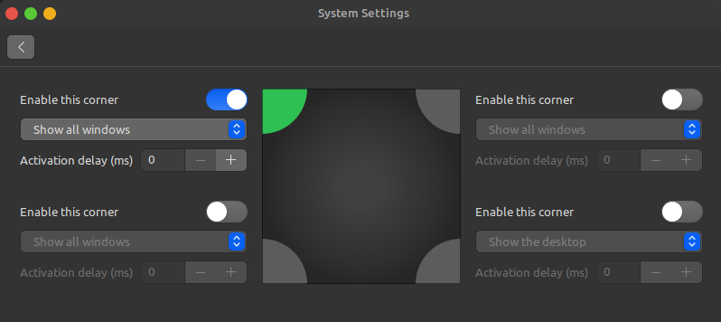

# Theming / visual aspect tweaking

0.  Run commands inside [mac_theme.sh](./mac_theme.sh)
1.  Open System Settings

    1. Navigate to Windows

       - Set buttons layout to left

       

           
       

       - On the Alt-Tab tab, switch Alt-Tab switcher style to Thumbnails only

       

           
       

    2. Navigate to Themes

       - Select WhiteSur options

       

           
       

    3. Navigate to Hot Corners

       - Enable top left corner to Show all Windows

       

           
       

